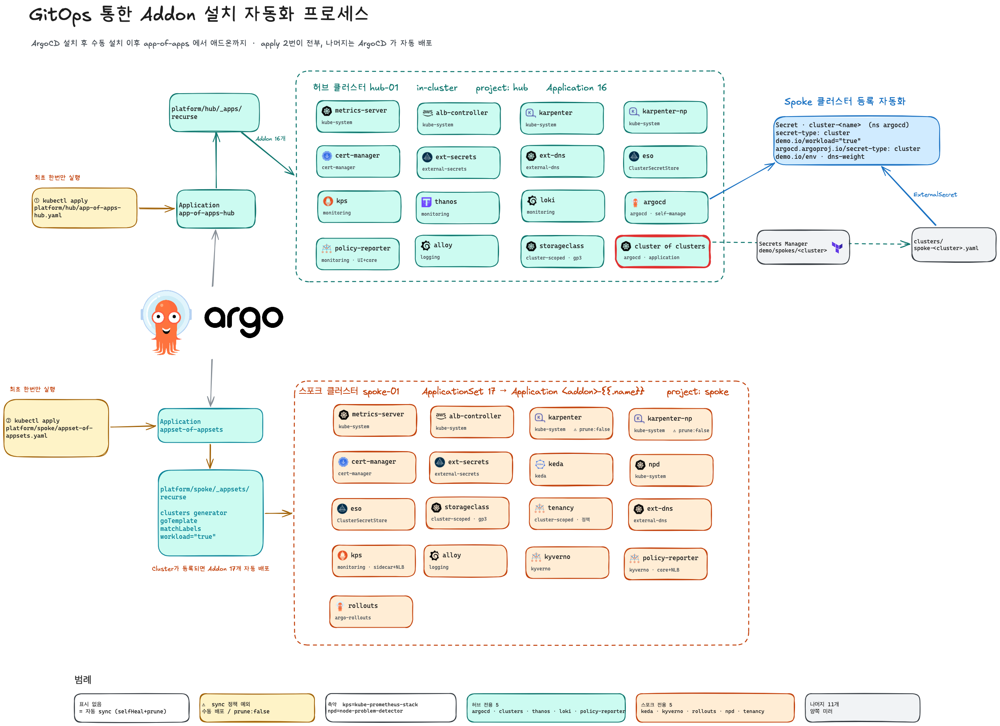
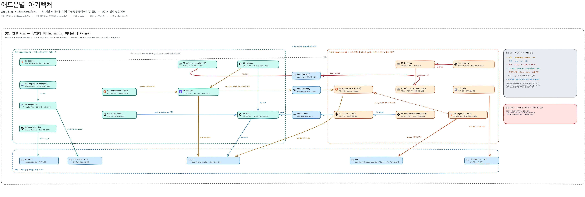

# eks-gitops

EKS 플랫폼의 **클러스터 안 절반** — ArgoCD 가 이 레포를 sync 한다.
AWS 쪽 절반과 전체 계획은 [`infra-terraform`](../infra-terraform).

## 아키텍처

GitOps 로 애드온을 까는 흐름 — 최초에 app-of-apps 를 허브·스포크 각각 한 번씩 `kubectl apply` 하면
나머지 애드온은 ArgoCD 가 전부 자동 배포한다. 스포크는 클러스터가 등록되는 순간 세트 전체가 따라붙는다.



애드온 연결 지도 — 무엇이 어디로 모이고 어디로 내려가는가. 허브는 조회·보관·배포가 모이는 곳,
스포크는 수집·집행 후 허브로 push. 클러스터 경계를 넘는 흐름은 internal NLB 를 지난다.



## 원칙 (infra 레포와 동일)

1. 클러스터는 소모품 (예외: 허브) · 2. TF/GitOps 경계 = 수명주기 · 3. 환경은 디렉토리 · 4. 이미지는 digest 승격 · 5. 관측 먼저

## 도구 경계 — platform=Helm, apps=Kustomize

| | 도구 | per-cluster/env 처리 |
|---|---|---|
| **platform/** (argocd·thanos 등 서드파티) | **Helm** (chart+values) | **values 파일** (`values-<cluster>.yaml`) |
| **apps/** (자사 서비스) | **Kustomize** (base+overlays) | **overlay** (`overlays/<env>`) |

⚠️ **`base/overlays` 는 Kustomize 개념이라 apps/ 에만 쓴다.** platform 은 Helm 이라 overlay 를 쓰지 않는다 —
클러스터 차이는 폴더 스코프(hub/workload/common) + values 파일로 표현한다.

## 디렉토리

```
platform/                     # Helm. 폴더 스코프로 클러스터 구분 (overlay 아님)
  hub/                        # 허브 전용: argocd ✓, thanos, grafana, alertmanager, loki, vault
    argocd/
      Chart.yaml  values.yaml   # 차트+값 (진실원천)
      install-argocd.sh         # ArgoCD 최초 설치/복구 (사람이 실행)
      root-app.yaml             # (B4) app-of-apps. 유일한 수동 kubectl apply ②
  workload/                   # 워크로드 전용: keda, kyverno, node-problem-detector
  common/                     # 양쪽 공통: karpenter, eso, alb-controller
    <comp>/{Chart.yaml, values.yaml, values-demo-hub-01.yaml, values-demo-eks-01.yaml}

clusters/                     # (C2) ApplicationSet — cluster generator
  platform-appset.yaml
  apps-appset.yaml

apps/                         # Kustomize. overlay 는 여기만
  <service>/{base, overlays/{dev,qa,uat,prod}}
```
> 지금 실제로 있는 건 `platform/hub/argocd/` 뿐. 나머지는 각 Phase 에서 만든다 (just-in-time).
> argocd 부트스트랩 산물(install 스크립트·root-app)도 argocd chart 폴더 안에 둔다 — helm 은 templates/ 외 파일은 무시하므로 chart 렌더에 영향 없음.

## 규칙

- **버전**: Helm 은 `Chart.yaml`(hub 전용) 또는 per-cluster values/`targetRevision`. `*`·`HEAD` 금지
- **허브 먼저 업그레이드**(F3): hub/ 컴포넌트는 그 폴더 Chart.yaml 만, common 은 per-cluster values 로 스태거
- sync wave 필수 · CRD 별도 Application + `Replace=true` · `ServerSideApply=true`(큰 CRD)
- `argocd.argoproj.io/manifest-generate-paths` · `selfHeal` on, prod `autoPrune` 신중
- (apps) Kustomize `openapi` 설정 — Rollout image transformer
